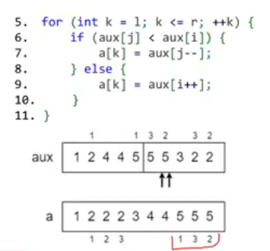
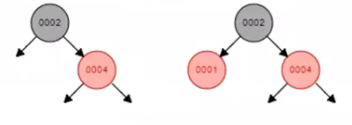
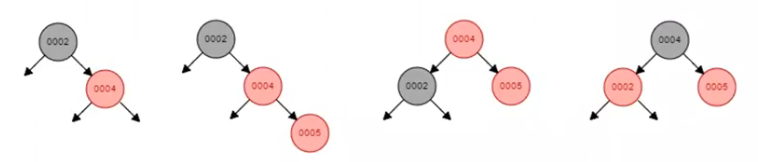
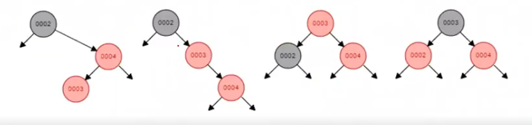
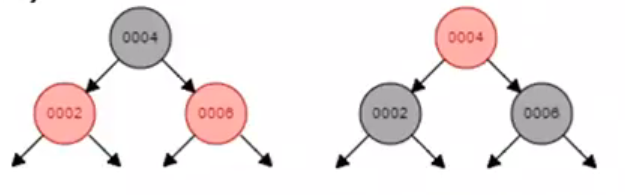
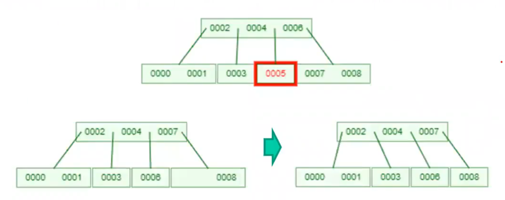
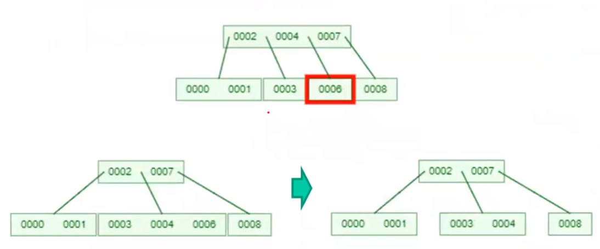
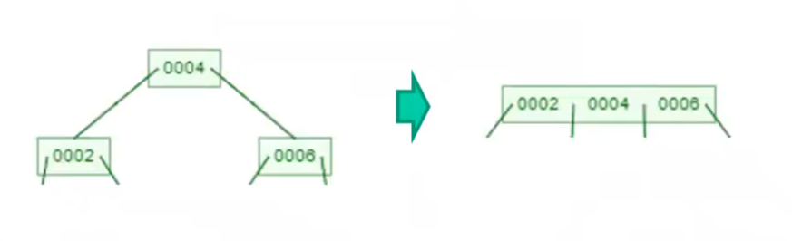
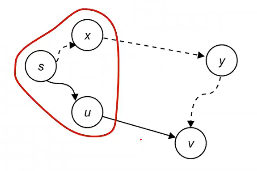
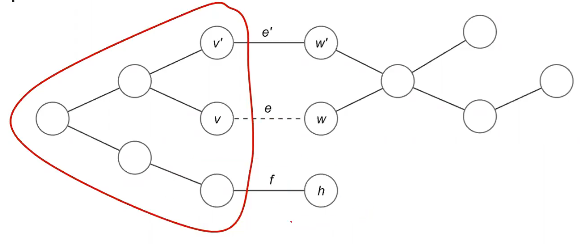

# Билет №1. Алгоритм, анализ сложности алгоритма. Асимптотика сложности алгоритма. Классы функций $O, o, \Theta, \Omega$

В каких единицах лучше измерять время работы (сложность) алгоритма?

Измерять в единицах времени - не практично, поскольку на разном железе будут разные результаты. Эталонную архитектуры мы взять не можем - споры по архитектуре процессора, языка программирования и компилятора (много неопределенностей)
Хочется сравнивать алгоритмы в вакууме, без привязки к конкретной платформы

От чего зависит время работы алгоритма?
- От меры размера задачи
- От самих входных данных (на одинаковом объеме при разных данных может быть разное время выполнения)
- От платформы исполнения
- От языка программирования и компилятора

Будем считать, что время выполнения ~ число выполненных операций

Можно говорить о среднем времени работы, которое строится на предположениях о частоте появления того или иного входа, но это требует знания предметной области
Мы будем опираться на худшее время работы алгоритма, которое дает верхнюю оценку времени выполнения вне зависимости от входных данных, что позволяет гарантировать время выполнения

Константы не всегда понятно как считать и но на больших числах это мало влияет

Подведем итог рассуждений. Мы будем считать, что лучший алгоритм - это алгоритм, худшее время работы которого растет наиболее медленно с увеличением размера входной задачи (смотрим только на прядок роста)

Теперь зададимся вопросом - а как описать время выполнения безотносительно ко входным данным, а не только в худшем случае?

*Асимптотическая верхняя граница*
Говорим, что $f(n) = O(g(n))$, если $\exists c, n_0 > 0 : 0 \leq f(n) \leq cg(n)$ для $\forall n \geq n_0$

*Асимптотическая нижняя граница*
Говорим, что $f(n) = \Omega(g(n))$, если $\exists c, n_0 > 0 : 0 \leq cg(n) \leq f(n)$ для $\forall n \geq n_0$

*Асимптотически точная граница*
Говорим, что $f(n) = \Theta(g(n))$, если $\exists c_1, c_2, n_0 > 0 : 0 \leq c_1 g(n) \leq f(n) \leq c_2 g(n)$ для $\forall n \geq n_0$

*о-малое*
Говорим, что $f = o(g)$ при $x \to x_0$, если $\forall \varepsilon > 0 \text{ } \exists \dot{U}(x_0) : \forall x \in \dot{U}(x_0) \Rightarrow |f(x)| < \varepsilon |g(x)|$
С приближением к точке $x_0$ $f$ уменьшается быстрее, чем $g$ ($\frac{|f(x)|}{|g(x)|} \normalsize\to 0$)

# Билет №2. Задача сортировки. Обзор и сравнительная характеристика методов сортировки

Сортировка - одна из самых естественных и распространенных задач. Сортированные данные очень удобны (для агрегации, дедупликации, бинарный поиск)

Сортировка требует иррефлексивного и транзитивного отношения линейного порядка на исходном множестве

Задача сортировки - получить перестановку, в которой ключи расположены в порядке неубывания. Пусть задан массив $a_1, \dots, a_n$. Мы хотим найти перестановку $\sigma \in S_n : a_{\sigma(1)} \leq \dots \leq a_{\sigma(n)}$

$a_1, \dots, a_n$ - массив. Мы хотим отсортировать его (в понятии перестановки), при этом равные элементы сохраняют свой порядок, то есть если $a_{\sigma(i)} = a_{\sigma(j)}$ и $i < j$, то и $\sigma(i) < \sigma(j)$
*Стабильной сортировкой* называется сортировка, удовлетворяющая этому условию

Адаптивный алгоритм - алгоритм, время выполнения которого зависит от входных данных


| Алгоритм      | Лучшее       | Среднее      | Худшее       | Память      | Стабильность | Особенности                                 |
| ------------- | ------------ | ------------ | ------------ | ----------- | ------------ | ------------------------------------------- |
| Выбором       | $O(n^2)$     | $O(n^2)$     | $O(n^2)$     | $O(1)$      | ❌            | Простой, всегда $n^2$                       |
| Пузырьком     | $O(n)$       | $O(n^2)$     | $O(n^2)$     | $O(1)$      | ✅            | Адаптивный                                  |
| Вставками     | $O(n)$       | $O(n^2)$     | $O(n^2)$     | $O(1)$      | ✅            | Адаптивный, хорош для почти отсортированных |
| Слиянием      | $O(n\log n)$ | $O(n\log n)$ | $O(n\log n)$ | $O(n)$      | ✅            | Гарантированно быстрая                      |
| Пирамидальная | $O(n\log n)$ | $O(n\log n)$ | $O(n\log n)$ | $O(1)$      | ❌            | In-place                                    |
| Быстрая       | $O(n\log n)$ | $O(n\log n)$ | $O(n^2)$     | $O(\log n)$ | ❌            | Самая быстрая на практике                   |


# Билет №3. Задача сортировки. Квадратичные сортировки (выбором, пузырьком, вставками). Сложность и корректность алгоритмов

Сортировка выбором: на каждой итерации находим минимум и кладем его в начало подмассива. Данная сортировка поддерживает инвариант - после $i$-ой итерации первые $i$ элементов отсортированы, при этом для $\forall j > i \Rightarrow a_j \geq a_i$
```python
for i in range(0, n):
	for j in range(0, n):
		if a[j] < a[i]:
			a[i], a[j] = a[j], a[i]
```
Оценка сложности - $O(n^2)$
Дополнительная память - $O(1)$


Сортировка пузырьком: повторяющийся проход по сортируемому массиву. На каждой итерации последовательно сравниваем соседние элементы, и, если порядок в паре неверный, то элементы меняем местами. Данная сортировка поддерживает инвариант - после $i$-ой итерации $i$ последних элементов отсортированы, при этом для $\forall j < n - i \Rightarrow a_j \leq a_i$
```python
for i in range(0, n - 1):
	for j in range(0, n - i - 1):
		if a[j] > a[j + 1]:
			a[j], a[j + 1] = a[j + 1], a[j]
```
Оценка сложности - $O(n^2)$
Дополнительная память - $O(1)$

Можно заметить, что если ни одного обмена за итерацию не произошло - значит массив уже отсортирован и нет смысла делать последующие проходы

Сортировка вставками: имеем уже отсортированный массив и наша задача - вставить в него остальные элементы, не нарушив упорядоченности. Последовательно вставляем входные данные
```python
for i in range(1, n):
	j = i - 1
	while j >= 0 and a[j] > a[j + 1]
		a[j], a[j + 1] = a[j + 1], a[j]
		j -= 1
```
Оценка сложности - $O(n + k)$, где $k$ - число обменов элементов входного массива (число инверсий). В общем случае - $O(n^2)$
Дополнительная память - $O(1)$
# Билет №4. Задача сортировки. Сортировка слиянием. Сложность и корректность сортировки

Алгоритм использует принцип "разделяй и властвуй"
```cpp
void merge_sort(int* a, int* aux, int l, int r) {
	if (l < r) {
		int m = (l + r) / 2;
		merge_sort(a, aux, l, m); // рекурсивный вызов
		merge_sort(a, aux, m + 1, r); // рекурсивный вызов
		merge(a, aux, l, m, r); // склеиваем два отсортированных массива
	}
}

void merge(int* a, int* aux, int l, int m, int r) {
	int i = l;
	int j = m + 1;
	// от копирования можно избавиться, проиниализировав массив aux сразу
	for (int k = l; k <= r; k++) {
		aux[k] = a[k];
	}
	for (int k = l; k <= r; k++) {
		if (i > m) {
			a[k] = aux[j++];
			continue;
		}
		if (j > r) {
			a[k] = aux[i++];
			continue;
		}
		if (aux[j] < aux[i]) {
			a[k] = aux[j++];
		} else {
			a[k] = au[i++];
		}
	}
}
```
Для заданного $n$ делим задачу на подзадачи всегда одинаковым способом
Время работы алгоритма не зависит от входных данных (только от размера задачи)
Является стабильной сортировкой

Оценка сложности - $T(n) = \Theta(n) + 2 T(\frac{n}{2}) = O(n\log n)$
Дополнительная память - $O(n)$

Слияние через битонический порядок:
```cpp
void merge_bitonic(int* a, int* aux, int l, int m, int r) {
	int i, j;
	for (i = m + 1; i > l; i--) {
		aux[i - 1] = a[i - 1];
	}
	for (j = m; j < r; j++) {
		aux[r + m - j] = a[j + 1];
	}
	
	for (int k = l; k <= r; k++) {
		if (aux[j] < aux[i]) {
			a[k] = aux[j--];
		} else {
			a[k] = aux[i++];
		}
	}
}
```
Убираем проверку выхода за границу (сокращая лишние операции). Получается, что строим "пирамидку" и идем по ее двум концам. Но мы теряем стабильность сортировки (в этом варианте)



Можно исправить, сохранив стабильность - сделать внешний цикл по $i$, доложив в конце оставшиеся элементы

## Bottom-Up
Мы описали так называемую Top-Down версию массива
Альтернатива - Bottom-Up
Пройдемся по массиву и сольем массивы размера 1, затем размера 2, 4 и так далее, получая итеративную версию алгоритма
Является более медленной, нежели рекурсивная версия из-за несбалансированности дерева. Чтобы это понять, достаточно рассмотреть задачу размера 5
Не использует память на рекурсивные вызовы

## Число инверсий

Сортировку слиянием можно применить для задачи подсчета числа инверсий. На этапе слияния мы получим количество инверсий на меньших кусочках, сложим их. Также нужно будет учесть и число расщепленных инверсий 
# Билет №5. Задача сортировки. Сортировка пирамидой (кучей). Сложность и корректность сортировки

Разработаем структуру данных *Приоритетную очередь* - множество $S$ из элементов $x$, с каждым элементов связан ключ $key$. Данная структура предоставляет следующий интерфейс:
- `insert(S, x)`
- `max(S) / min(S)`
- `extract_max(S) / extract_min(S)`
- `increase_key(S, x, key) / decrease_key(S, x, key)`
Обыкновенная очередь тоже можно рассмотреть как приоритетную очередь, где приоритет - время добавления
Интуитивная реализация - (не)отсортированный массив

Используем бинарное дерево
Храним $S$ в массиве $a_1, \dots, a_n$. Строим (в голове) двоичное дерево: корень - вершина $a_1$, ее потомки - $a_2, a_3$, у них $a_4, a_5$ и $a_6, a_7$ соответственно. Теперь предъявим к этой структуре требование кучи: число, записанное в вершине, меньше или равно любого из числа, в вершинах его потомков.
Тогда высота $h$ пирамиды из $n$ элементов составляет $\lfloor \log_2 n \rfloor$

Для вершины с номером $i$
- Левый ребенок - $2i + 1$
- Правый ребенок - $2i + 2$
- Родитель - $\lfloor \frac{i - 1}{2} \rfloor$
Что позволяет удобно хранить элементы в массиве

```cpp
int parent(int i) {
	return (i - 1) / 2;
}

int left(int i) {
	return 2 * i + 1;
}

int right(int i) {
	return 2 * i + 2;
}
```

Теперь предъявим условие - значение родителя должно быть не меньше (не больше) любого из его потомков. Тогда максимум (минимум) будет лежать в корне

`insert` - вставим новый элемент в конец массива, дальше будем менять местами новую вершину и ее родителя пока меняется. Такая операция локальна и не ломает условие пирамиды в других местах. Меняя родителя и новую вершину, мы не нарушаем условия (родитель только увеличился)
```cpp
void siftup(int* a, int i) {
	// либо попали в корень, либо родитель меньше
	while (i > 0 && a[parent(i)] < a[i]) { 
		swap(a[i], a[parent[i));
		i = parent(i);
	}
}

void insert(int* a, int& n, int x) {
	a[n++] = x;
	siftup(a, n - 1);
}
```
Сложность этой операции - $O(\log n)$
Дополнительная память - $O(1)$

`extract_max` - поменяем корень с последней вершиной в массиве. Если мы сломали пирамиду, то меняем корень с максимальным из детей, спускаясь вниз

```cpp
void siftdown(int* a, int n, int i) { 
	int j = i;
	if (left(i) < n && a[j] < a[left(i)]) {
		j = left(i);
	}
	if (right(i) < n && a[j] < a[right(i)]) {
		j = right(i);
	}
	// j - максимум из трех элементов (i, left(i), right(i))
	if (i != j) {
		swap(a[i], a[j]);
		siftdown(a, n , j);
	}
}

int extract_max(int* a, int& n) {
	swap(a[0], a[--n]);
	siftdown(a, n, 0);
	return a[n];
}
```
Сложность операции - $O(\log n)$
Дополнительная память - $O(\log n)$ - рекурсивные вызовы
Альтернатива:
```cpp
void siftdown(int* a, int n, int i) { 
	int j = i;
	while (true) {
		if (left(i) < n && a[j] < a[left(i)]) {
			j = left(i);
		}
		if (right(i) < n && a[j] < a[right(i)]) {
			j = right(i);
		}
		// j - максимум из трех элементов (i, left(i), right(i))
		if (i == j) {
			break;
		}
		swap(a[i], a[j]);
		i = j;
	}
}
```
Константная дополнительная память. Логарифмическая сложность

`increase_key` - понятно, что, если мы знаем индекс вершины, то нам достаточно поменять значение в ней и выполнить `siftup`

## Построение пирамиды

Интуитивно - просто вставляем элементы в пирамиду
```cpp
void build_heap_insert(int* a, int n) {
	int sz = 0;
	while (sz < n) {
		insert(a, sz, a[sz]);
	}
}
```
Сложность - $O(n\log n)$

Предложим другое решение построения кучи:
```cpp
void build_heap(int* a, int n) {
	for (int i = n / 2 - 1; i >= 0; i--) {
		siftdown(a, n, i);
	}
}
```

Корректность - по индукции

Теперь разберемся, почему асимптотика $O(n)$. Нестрого
Мы знаем, сколько вершин на каждом уровне - на первом $1$, на втором - $2$, на третьем - $4$, и так далее на последнем примерно $\frac{n}{2}$. На листьях алгоритм работает за единицу, вообще время его выполнения пропорционально глубине дерева. Тогда время выполнения равно

$$
\begin{aligned}
&\frac{n}{2}1 + \frac{n}{4}2 + \frac{n}{8}3 + \dots = \\
& = \frac{n}{2} + \frac{n}{4} + \frac{n}{8} + \dots + (\frac{n}{4}1 + \frac{n}{8}2 + \frac{n}{16}3 + \dots) = \\
& = n + \frac{n}{2} + \frac{n}{4} + \frac{n}{8} + \dots + (\frac{n}{8}1 + \frac{n}{16}2 + \frac{n}{32}3 + \dots) = \\
& = n + \frac{n}{2} + \frac{n}{4} + \frac{n}{8}
\leq 2n
\end{aligned}
$$

## Heap-sort

```cpp
void heap_sort(int* a, int n) {
	build_heap(a, n);
	for (int l = n - 1; l > 0; l--) {
		swap(a[0], a[l]);
		siftdown(a, l, 0);
	}
}
```
Прелесть в том, что мы можем реализовать in place сортировку
Оценка сложности - $O(n \log n)$
Дополнительная память - $O(1)$
# Билет №6. Задача сортировки. Быстрая сортировка. Сложность и корректность сортировки

Использует метод "разделяй и властвуй", но при этом основная работы выполняется до выполнения рекурсивного вызова
Время работы алгоритма зависит от входных данных

Первый шаг - разбиение
Выберем некоторый опорный элемент ($pivot$, $p$)
- Слева от опорного элемента стоят элементы, не большие $p$ 
- Справа от опорного элемента стоят элементы, не меньшие $p$
Таким образом после выполнения такого разделения $pivot$ окажется на своем месте

## Разбиение Ломуто

```cpp
int partition(int* a, int l, int r) {
	int pivot_index = l; // choose pivot (a, l, r)
	if (pivot_index != l) {
		swap(a[l], a[pivot_index]);
	}
	int p = a[l];
	int i = l + 1; // указатель на левые элементы (не большие pivot)
	for (int j = l + 1; j <= r; j++) { // бегаем по массиву
		if (a[j] < p) {
			swap(a[j], a[i]);
			i++;
		}
	}
	swap(a[l], a[i - 1]);
	return i - 1;
}
```
Оценка сложности - $\Theta(n)$
Дополнительная память - $O(1)$
Но разбиение, скажем так, не сбалансировано - элементы, равные $pivot$ попадут лишь в одну из частей

## Разбиение Хоара

```cpp
int partition(int* a, int l, int r) {
	int pivot_index = l; // choose pivot (a, l, r)
	if (pivot_index != l) {
		swap(a[l], a[pivot_index]);
	}
	int p = a[l];
	int i = l;
	int j = r + 1;
	for ( ; ; ) {
		while (a[++i] < p) {
			if (i == r) {
				break;
			}
		}
		while (a[--j] > p) {
		
		}
		if (i >= j) {
			break;
		}
		swap(a[i], a[j]);
	}
	swap(a[l], a[j]);
	return j;
}
```
Оценка сложности - $\Theta(n)$
Дополнительная память - $O(1)$
Но равные элементы распределяться более равномерно

После того, как мы научились делать разбиения, сама сортировка становится простой
```cpp
void quidsort(int* a, int l, int r) {
	if (r <= l) {
		return;
	}
	int p = partition(a, l, r); // индекс опорного элемента
	quicksort(a, l, p - 1);
	quicksort(a, p + 1, r);
}
```
Оценка сложности - $O(n^2)$
	Худший вариант - отсортированные данные
	Лучший вариант - на каждом шаге выбираем медиану
Дополнительная память - $O(1)$ + рекурсивные вызовы

## Медиана из трех элементов

```cpp
inline void comp_swap(int& a, int& b) {
	if (a > b) {
		swap(a, b);
	}
}

void quicksort(int* a, int l, int r) {
	if (r <= l) {
		return;
	}
	swap(a[(l + r) / 2], a[l + 1]);
	
	// выбираем медиану из трех элементов (a[l], a[m], a[r])
	comp_swap(a[l], a[l + 1]);
	comp_swap(a[l], a[r]);
	comp_swap(a[l + 1], a[r]);
	
	if (r - l <= 2) {
		return;
	}
	int p = partition(a, l + 1, r - 1);
	quicksort(a, l, p - 1);
	quicksort(a, p + 1, r);
}
```

## Рандомизированная быстрая сортировка

Давайте откажемся от детерминированности, добавив рандомизацию
```cpp
inline int choose_pivot(int* a, int l, int r) {
	return l + (rand() % (r - l + 1));
}
```
Время работы - случайная величина: на одном и том же массиве будет разное время исполнения алгоритма
Поскольку время стало случайной величиной, имеет смысл анализировать математическое ожидание

Сложность работы алгоритма определяется общим числом сравнений, выполняемых при всех вызовах `partition` - время работы определяется выбором $pivot$

Пространство выборок $S$ - все возможные исходы случайного выбора последовательности опорных элементов
Случайная величина $X(e)$ - число сравнений двух элементов массива друг с другом при выполнении быстрой сортировки для фиксированного выбора опорных элементов $e$
Гипотеза $EX = O(n \log n)$

Пусть $z_i$ - $i$-ый наименьший элемент массива ($i$-ая порядковая статистика)
Для фиксированного выбора опорных элементов $e$ и индексов $i < j$ определим случайную величину $X_{ij}(e)$ как число сравнений двух элементов $z_i$ и $z_j$ в ходе работы алгоритма
Сколько раз могут сравниться два фиксированных элемента?
Может быть ноль - если их разделил опорный элемент
Может быть ровно один раз - если один из элементов стал опорным
Таким образом $X_{ij}$ - индикаторная случайная величина ($z_i$ и $z_j$ сравнились)
Всего $X = \sum\sum X_{ij}$, $EX = \sum\limits_{i=1}^{n-1} \sum\limits_{j = i + 1}^n P(X_{ij})$
Теперь наша задача - определить вероятность того, что $z_i$ сравниться с $z_j$

Рассмотрим множество $Z_{ij} = \{z_i, \dots, z_j\}$
Пока опорный элемент выбирается вне $Z_{ij}$, все элементы передаются в один рекурсивный вызов
Если в качестве опорного выбран любой кроме $z_i, z_j$, то они никогда не сравняться
Поэтому $P(z_i \text{ сравниться с } z_j) = \frac{2}{j - i + 1}$

Ну и мы так-то победили:
$EX = \sum\limits_{i=1}^{n-1} \sum\limits_{j = i + 1}^n P(X_{ij}) = \sum\limits_{i=1}^{n-1} \sum\limits_{j = i + 1}^n \frac{2}{j - i + 1}\normalsize = \sum\limits_{i=1}^{n-1}2 (\frac{1}{2} + \dots + \frac{1}{n - i + 1}) < \sum\limits_{i=1}^{n-1}2 (\frac{1}{2} + \dots + \frac{1}{n}) < 2n\sum\limits_{i=1}^{n-1}\frac{1}{i}$
Как мы знаем гармонический ряд не превосходит $\ln n$
Таким образом $EX < 2n\ln n$

## Маленькие подмассивы
На маленьких подмассивах рекурсивный характер быстрой сортировки (любого рекурсивного алгоритма) неэффективен
На почти хорошо отсортированном массиве хорошо ебя ведет сортировка вставками

```cpp
void quicksort(int* a, int l, int r) {
	// if (r - l <= k) {
	//     insertion_sort(a, l, r);
	// }
	if (r - l <= k) {
		return;
	}
	int p = partition(a, l, r);
	quicksort(a, l, p - 1);
	quicksort(a, p + 1, r);
}  ... insertion_sort(a, l, r);
```
Оценка сложности - $O(nk + n \log \frac{n}{k})$ ($k \approx \frac{n}{2^x}$)

## Дублированные ключи
Часто в массиве большое число одинаковых ключей
Даже если в подмассиве остались только одинаковые ключи быстрая сортировка все равно скатится в рекурсию
Разделим массив на **три** части так, что
1. Слева - строго меньшие
2. Справа - строго большие
3. Посередине - равные опорному
Рекурсивные вызовы происходят только на левой и правой частях
Если число различных элементов константно, сортировка отработает за линейное время, поскольку на каждом разбиении исключаем все ключи, равные опорному
Варианты реализации:
- Три указателя (Дейкстра). Но наличие одного дубликата сильно портит жизнь
- Разбиение на три (четыре) части (Бентли и Макилрой). Равные по краям, затем их срастить в центре. Но повторный проход пропорционален числу дубликатов 

## Трехчастная поразрядная быстрая сортировка строк

Сортируем массив указателей `char*`
Сравнение строк работает за время, сравнимое с длиной строки
В центральной части передаем знание о общем префиксе

## Глубина стека

```cpp
void quicksort(int* a, int l, int r) {
	while (r > l) {
		int p = partition(a, l, r);
		quicksort(a, l, p - 1); // можем уйти глубоко
		l = p + 1;
	}
}

void quicksort(int* a, int l, int r) {
	while (r > l) {
		int p = partition(a, l, r);
		if (p - 1 < r - p) {
			quicksort(a, l, p - 1);
			l = p + 1;
		} else {
			quicksort(a, p + 1, r);
			r = p - 1;
		}
	}	
}
```

## Quick Select

Задача - найти $k$-ую порядковую статистику
Можно вначале отсортировать массив и выбрать нужный элемент, а можно пойти по другому пути
```cpp
void select(int* a, int l, int r, int k) {
	if (r <= l) return;
	int p = partition(a, l, r);
	if (p > k) select(a, l, p - 1, k);
	if (p < k) select(a, p + 1, r, k);
}
```
Если очень сильно не везет - $T(n) = T(n - 1) + \Theta(n)$
Если не хуже, чем $3/4$ - $T(n) \leq T(3 n / 4) + \Theta(n)$ - линия

То же самое расписываем мат ожидание - получаем линию

Нерекурсивная выборка
```cpp
void select(int* a, int l, int r, int k) {
	while (r > l) {
		int p = partition(a, l, r);
		if (p == k) break;
		if (p > k) r = p - 1;
		if (p < k) l = p + 1;
	}
}
```

Часто бывает нужно выбрать несколько порядковых статистик. Можно несколько раз дернуть `select`, можно так же отсортировать и выбрать нужное. 
Но можно использовать частичную сортировку - нашли какой-то перцентилей и кусочек посортили. Можно полностью нужный кусок сортить, а там, где лишнее - `select`. (безусловная и условная рекурсии)
# Билет №7. Структуры данных. Массив, стек, очередь, одно- и двусвязные списки

*Структуры данных* - некоторый вид организации и хранения данных, который может быть использован для **эффективного** решения конкретных задач

Тип данных определяет:
- множество допустимых значений данных этого типа
- набор допустимых операций над данными этого типа
Примитивы и пользовательские типы - структуры и классы
Интерфейс - объявление функций (методов), через который осуществляется работа с данными (без реализации)
Абстрактный тип данных (АТД) - это тип данных, который задан только описанием своего интерфейса
Цель - скрыть способ хранения данных и алгоритмы работы с ними внутри функции интерфейса
Детальное описание АТД - конкретная структура данных
АТД удобно использовать при описании алгоритмов, не вдаваясь в подробности реализации АТД

Линейные типы данных:
- массивы
- список
  `insert`, `delete`, `prev`, `next`, `lookup`
- стек
  `push`, `pop`, `top`
- очередь
  `enqueue`, `dequeue`, `front`
- дек
  `push_back`, `pop_back`, `push_front`, `pop_front`, `back`, `front`

Нелинейные типы данных:
- множество
- ассоциативный массив
- упорядоченное множество (ordered set / map)
  `insert`, `delete`, `lookup`, `min`, `max`, `succesor`, `predecessor`
- неупорядоченное множество (unordered set / map)
  `insert`, `delete`, `lookup`
- приоритетная очередь
  `insert`, `max`, `extract_max`, `increase_key`
- граф

## Список
- Хранит последовательность объектов
- Предоставляет последовательный доступ
- Эффективная вставка / удаление в середину списка
- Бывают односвязные и двусвязные

## Связный список
```cpp
class Node {
public:
	Node(const string& s);
private:
	string m_data;
	Node* m_prev;
	Node* m_next;
friend class List;
friend class Iterator;
};
```

```cpp
class List {
public:
	List() {
		m_first = NULL;
		m_last = NULL;
	}
	void push_back(const string& data);
	void insert(Iterator pos, const string& s);
	Iterator erase(Iterator pos);
	Iterator begin();
	Iterator end();
private:
	Node* m_first;
	Node* m_last
};
```

```cpp
void List::push_back(const string& data) {
	Node* new_node = new Node(data);
	if (m_last == NULL) { // проверка на пустой список - оверхед
		m_first = new_node;
		n_last = new_node;
	} else {
		new_node->m_prev = m_last;
		m_last->m_mext = new_node;
		m_last = new_node;
	}
}
```

```cpp
void List::insert(Iterator iter, const string& s) {
	if (iter.position == NULL) {
		push_back(s);
		return
	}
	Node* after = iter.position;
	Node* before = after->m_prev;
	Node* new_node = new Node(s);
	new_node->m_prev = before;
	new_node->m_next = after;
	after->m_prev = new_node;
	if (before == NULL) {
		m_first = new_node;
	} else {
		before->m_next = new_node;
	}
}
```

Иногда используют реализацию, где используется фиктивная голова/хвост (список никогда не пустой)
```cpp
List() {
	Node* dummy_head = new Node("DUMMY_DEAD");
	m_first = dummy_head;
	m_last = dummy_head;
}

void List::push_back(const string& data) {
	Node* new_node = new Node(data);
	new_node->m_prev = m_last;
	m_last->m_mext = new_node;
	m_last = new_node;
}
```

Реализация на связном списке использует много `new`, что увеличивает фрагментацию памяти. Эти операции не дешевые

## Список на массиве(ах)

```cpp
class List {
...
private:
	string m_nodes[100];
	size_t m_prev[100];
	size_t m_next[100];
	size_t mfirst;
	size_t m_last;
	size_t m_free;
};

List() {
	m_nodes[0] = "DUMMY_HEAD";
	m_first = 0;
	m_last = 0;
	m_free = 1;
}
```

```cpp
void List::push_back(const string& data) {
	m_nodes[m_free] = data;
	m_prev[m_free] = m_last;
	m_next[m_free] = m_free;
	m_last = m_free;
	m_free++;
}
```

Можно поддержать `list<size_t> m_freelist`
```cpp
m_free = m_freelist.back();
m_freelist.pop_back();
m_freelist.push_back(m_free);
```

## Мультисписок

```cpp
class List {
...
private:
	static string s_nodes[100];
	static size_t s_prev[100];
	static size_t s_next[100];
	size_t mfirst;
	size_t m_last;
	static size_t s_free;
}

List() {
	s_nodes[s_free.back()] = "DUMMY_HEAD";
	m_first = s_free.back();
	m_last = s_free.back();
	s_free.pop_back();
}
```

## Вектор

`std::vector` - реализация динамического массива. Выделяет массив заданного массива, но при переполнении выделяется больший (скажем, в два раза больший) кусок памяти. Позволяет программисту не контролировать размер массива
Получение $k$-го элемента - $O(1)$
Вставка/удаление в заданную позицию - $O(n)$
Вставка/удаление в конец - $O^*(1)$
Реаллокация инвалидирует все  итераторы / указатели на элементы

## Стек и очередь
Стек и очередь поддерживают только добавление/удаление из множеств
В стандартной библиотеке стек можно параметризовать - выбрать реализацию на списке или на массиве. Для очереди в стандартной библиотеке только реализация на списке
Позволяют удобно хранить, например, набор задач, ожидающих выполнения

С помощью стека, например, можно оптимизировать быструю сортировку, сократив глубину стека вызовов:
```cpp
void quicksort(int* a, int l, int r) {
	std::stack<std::pair<int, int>> s;
	s.push({l, r});
	while (!s.empty()) {
		l = s.top().first;
		r = s.top().second;
		s.pop();
		
		if (r <= l) continue;
		int p = partition(a, l, r);
		if (p - l > r - p) {
			s.push({l, p - 1});
			s.push({p + 1, r}); // сначала обработаем то, что меньше
		} else {
			s.push({p + 1, r});
			s.push({l, p - 1}); // сначала обработаем то, что меньше
		}
	}
}
```

Стек удобен для обратной польской нотации
> **Определение**
> Обратная польская запись (ОПЗ) - запись арифметических выражение без использования скобок, позволяющая однозначно задавать выражение. Отвечает следующим требованиям
> 1. Если $x$ - число $\Rightarrow$ $x$ - ОПЗ
> 2. $\alpha, \beta$ - ОПЗ $\Rightarrow$
>    $\alpha \text{ } \beta \text{ } +$
>    $\alpha \text{ } \beta \text{ } -$
>    $\alpha \text{ } \beta \text{ } *$
>    $\alpha \text{ } \beta \text{ } /$
>    ОПЗ

Каждый операнд кладем на стек, каждая операция достает нужное количество операндов. Очень удобно для парсинга и компиляции

Можем также реализовать мультистек 


# Билет №8. Бинарные (двоичные) деревья поиска. Обход дерева. Операции вставки, удаления

Таблица символов - структура данных для хранения пар вида <ключ, значение>
Основные поддерживаемые операции:
- Вставка нового элемента
- Поиск элемента с заданным ключом
- Удаление указанного элемента
Указанный элемент - это указатель (может инвалидировать другие итераторы) или ключ 
Также на уровне интерфейса встает вопрос работы с дубликатами. Мы не будем их поддерживать. Для реализации можно, например, по ключу хранить список элементов и задачу работы с дубликатами свалить на пользователя. 

Определимся с интерфейсами ключа и элемента
```cpp
class Key {
public:
	...
	friend bool operator< (const Key& k1, const Key& k2);
	friend bool operator== (const Key& k1, const Key& k2);
};

class Item {
public:
	Key key() const;
	bool null() const;
	void show(ostream& out = cout) const;
};
```

Интерфейс таблица символов:
```cpp
class SymbolTable {
public:
	SymbolTable();
	size_t count(); // лениво или агрессивно
	Item search(const Key& k);
	void insert(Item x);
	void remove(const Item& x);
	Item min();
	Item max();
	Item select(size_t i); // i-ая порядковая статистика
	size_t rank(const Item& x); // количество элементов, меньших x
	Item pred(const Key& k);
	Item succ(const Key& k);
	void show(ostream& out = cout);
}
```
Альтернативные названия данного интерфейса - ассоциативный массив (associative array, map), словарь (dictionary)
Мы уже можем реализовать на (не)отсортированном массиве, но они не очень гибкие

## Бинарные деревья поиска


Упорядоченные массивы

| Операция                     | Оценка сложности |
| ---------------------------- | ---------------- |
| Поиск по ключу               | $O(\log n )$     |
| Порядковая статистика        | $O(1)$           |
| Наименьший/наибольший ключ   | $O(1)$           |
| Предыдущий/следующий ключ    | $O(1)$           |
| Ранг                         | $O(\log n)$      |
| Вывод в отсортированном виде | $O(n)$           |
| Вставка                      | $O(n)$           |
| Удаление                     | $O(n)$           |

Сбалансированные деревья поиска

| Операция                     | Оценка сложности |
| ---------------------------- | ---------------- |
| Поиск по ключу               | $O(\log n )$     |
| Порядковая статистика        | $O(\log n)$      |
| Наименьший/наибольший ключ   | $O(\log n)$      |
| Предыдущий/следующий ключ    | $O(\log n)$      |
| Ранг                         | $O(\log n)$      |
| Вывод в отсортированном виде | $O(n)$           |
| Вставка                      | $O(\log n)$      |
| Удаление                     | $O(\log n)$      |

Бинарное дерево поиска - это бинарное дерево, в котором:
- в каждом узле содержится ключ (и связанное с ним значение)
- ключи всех узлов левого поддерева меньше (либо равны) ключа родительского узла
- ключи всех узлов правого поддерева больше (либо равны) ключа родительского узла
Структура бинарного дерева поиска аналогична разбиению при быстрой сортировке

```cpp
class SymbolTable {
...
private:
struct Node {
	Item item;
	Node* left;
	Node* right;
	seze_t count; // количество узлов в поддереве с этим корнем
	Node(Item x) {
		item = x;
		count = 1;
		left = NULL;
		right = NULL;
	}
};

Node* m_root;
Item nullItem;
};
```

Тогда понятен алгоритм поиска по ключу:
 - Если дерево пусто - промах
 - Сравниваем ключ корня с искомым
   Если совпали - победа
   Если нет, то сразу понятно, в какого ребенка свалиться
```cpp
public:
Item search(const Key& k) {
	return do_search(m_root, k);
}
...
private:
Item do_search(Node* node, const Key& k) {
	if (node == NULL) return nullItem;
	Key t = node->item.key();
	if (k == t) return node->item;
	if (k < t) return do_search(node->left, k);
	else return do_search(node->right, k);
}
```
Отметим, что если мы не нашли элемент, то мы найдем место, куда стоит вставить этот элемент
```cpp
void do_insert(Node* & node, Item x) {
	if (node == NULL) {
		node = new Node(x);
		return;
	}
	Key t = node->item.key();
	if (x.key() == t) return;
	if (x.key() < t) do_insert(node->left, x);
	else do_insert(node->right, x);
	// node->count++; ??? вставка может провалиться - ээлемент уже есть
	node->count = 1 + do_count(node->left) + do_count(node->right);
	// node->left->count ??? левого или правого может не быть
}
```

Встает проблема - для заданного множества ключей можно построить несколько бинарных деревьев поиска. И высота БДП может лежать в пределах от $\log_2 n$ (наилучший случай) до $n$ (выстроились в линию). Нам бы, конечно, хотелось иметь наименьшую высоту дерева, поскольку большинство операций работают пропорционально высоте дерева. Задача балансировки бинарного дерева будет рассмотрена позже

Обход дерева можно осуществить разными способами:
- Прямой обход (preorder): узел, затем левое и правое поддеревья
- Поперечный обход (inorder): левое поддерево, узел правое
- Обратный обход (postorder): сначала левое и правое поддеревья, затем узел

```cpp
void do_show(Node* node, ostream& out) {
	if (node == NULL) return;
	do_show(node->left, out);
	node->item.show(out);
	do_show(node->right, out);
}
```

Задача поиска наименьшего ключа сводится к поиску самого левого потомка (если потомков нет - то корень). Аналогично для наибольшего 

```cpp
public:
Item min() {
	return do_min(m_root);
}
...
private:
Item do_min(Node* node) {
	if (node->left == NULL) return node->item;
	return do_min(node->left);
}
```

Задача поиска предыдущего элемента:
- Если левое поддерево не пусто, то нужно вернуть `max()` оттуда
- Если левое поддерево пусто, то нужно подняться наверх пока не встретим ключ, меньше заданного (первый поворот налево при подъеме)
- Если поворот налево не произошел, то значит, что предыдущего элемента нет
Аналогично задача поиска следующего элемента
```cpp
Item do_pred(Node* node, const Key& k) {
	if (node == NULL) return nullItem;
	Key t = node->item.key();
	if (k == t) {
		if (node->left != NULL) return do_max(node->left);
		else return nullItem;
	}
	if (k < t) return do_pred(node->left, k);
	else {
		Item x = do_pred(node->right, k);
		if (x.null()) return node->item; // Если мы встретили поворот налево при подъеме
		else return x;
	}
}
```

Задача выборки в БДП (поиск порядковой статистики)
В точности $i$ других элементов меньше искомого
Для решения этой задачи мы поддерживаем переменную `count` - количество узлов в дереве с корнем в данной вершине
```cpp
Item do_select(Node* node, size_t i) {
	if (node == NULL) reutrn nullItem;
	
	size_t c = 0;
	if (node->left != Null) c = node->left->count;
	
	if (c == i) return node->item;
	if (c > i) return do_select(node->left, i);
	else return do_select(node->right, i - c - 1);
}
```

Определение ранга ключа решается похожим образом
```cpp
size_t do_rank(Node* node, const Key& k) {
	if (node == NULL) return 0;
	Key t = node->item.key();
	if (k == t) return do_count(node->left);
	if (k < t) return do_rank(node->left, k);
	else return 1 + do_count(node->left) + do_rank(node->right, k);
}
```

Удаление элемента может происходить двумя способами:
- Удаление по указателю
  Необходимо поменять указатель родительского узла на удаляемый элемент
  В узел добавляем указатель на родителя
  Ленивое удаление 
- Удаление через поиск по ключу
  Находим удаляемый элемент с заданным ключом
  В процессе поиска получаем указатель родительского узла на удаляемый
Возможны три сценария:
1. Удаляемый узел не имеет потомков
   Проблем не наблюдается
2. Удаляемый узел имеет одного потомка
   Переподвесим одно из поддеревьев вместо удаляемого
3. Удаляемый узел имеет двух потомков
   Можно поставить либо следующий за удаляемым элемент или предыдущий (минимум в правом поддереве или максимум в левом). У следующего или предыдущего элемента может быть один потомок, но эту задачу мы решать уже умеем - вариант 2
```cpp
void do_remove(Node* & node, const Key& k) {
	if (node == NULL) return;
	Key t = node->item.key();
	if (k == t) {
		// вариант 1
		if (node->left == NULL && node->right == NULL) {
			delete node;
			node = NULL;
			return;
		}
		// вариант 2
		else if (node->left == NULL) {
			Node* tmp = node;
			node = node->right;
			delete tmp;
			return;
		}
		else if (node->right == NULL) {...}
		// вариант 3
		else {
			Node* tmp = node->right; 
			// поиск следующего элемента
			while (tmp->left != NULL) {
				tmp = tmp->left;
			}
			node->item = rmp->item;
			do_remove(node->right, tmp->item.key()); // удаляем следующий элемент
		}
	}
	if (k < t) do_remove(node->left, k);
	if (t < k) do_remove(node->right, k);
	node->count = 1 + do_count(node->left) + do_count(node->right);
}
```


# Билет №9. Задача балансировки бинарных (двоичных) деревьев. Красно-черные деревья: определение, вычислительная сложность операций поиска, вставки и удаления

Для начала познакомимся с такой операцией, как поворот дерева
Меняем местами корень и один из его дочерних узлов: дочерний узел поднимается, корень опускается. Сохраняем порядок ключей в узлах БДП
По сути своей является локальной операцией, затрагивает два узла и три связи
```cpp
void do_rot_right(Node* & node) {
	Node* tmp = node->left;
	node->left = tmp->right;
	tmp->right = node;
	
	tmp->count = node->count;
	node->count = 1 + do_count(node->left) + do_count(node->right);
	node = tmp;
}

void do_rot_left(Node* & node) {
	...
}
```

Если мы хотим вставить ключ в корень БДП, то мы его вставим как обычно, а затем поднимем его до корня с помощью поворотов
```cpp
void do_insert_root(Node* & node, Item x) {
	if (node == NULL) {
		node = new Node(x);
		return
	}
	Key t = node->item.key();
	if (x.key() == t) return;
	if (x.key() < t) {
		do_insert_root(node->left, x);
		node->count = 1 + do_count(node->right) + do_count(node->left);
		do_rot_right(node);
	} else {
		...
	}
}
```
Можно аналогично изменить `do_search()`, чтобы  подтягивать к корню данные, с которыми мы часто работаем (в случае, если мы работаем преимущественно с каким-то небольшим относительно всего дерева множества)

Теперь мы можем выполнить разбиение БДП
```cpp
void do_partition(Node* & node, size_t i) {
	size_t c = 0;
	if (node->left != NULL) c = node->left->count;
	if (c == i) return;
	if (c > i) {
		do_partition(node->left, i);
		do_rot_right(node);
	} else {
		do_partition(node->right, i - c - 1);
		do_rot_left(node);
	}
}
```
Если мы например разобьем дерево по медиане, то с обоих сторон будет равное количество вершин (напомним, что мы сейчас занимаемся балансировкой дерева, хотим, чтобы дерево было почти всегда сбалансированным). И вот мы получили первое решение - периодические балансировки с помощью разбиений
```cpp
void do_balance(Node* & node) {
	if ((node == NULL) || (node->count == 1)) return;
	
	do_partition(node, node->count / 2);
	
	do_balance(node->left);
	do_balance(node->right);
}
```
Но эта балансировка выполняется за линию. Поэтому мы будем заниматься не глобальной балансировкой, а локальной балансировкой при операциях вставки / удаления / (поиска)

## 2-3-4 деревья поиска
Начнем с 2-3-4 деревьев (которые являются частным случаем b-дерева), которые прольют свет на появление красно-черных деревьев
Позволим узлам содержать более одного ключа
2-3-4 дерево поиска - это либо пустое дерево, либо дерево содержащее три типа узлов:
- 2-узлы с одним ключом и двумя связями
- 3-узлы с двумя ключами и тремя связями
- 4-узлы с тремя ключами и четырьмя связями
Диапазоны определяются ключами узла

b-деревья имеют прекрасное свойство - они идеально сбалансированы: расстояние от корня до любой вершины одинаково

Операция поиска аналогична БДП

Вставка аналогично, ищем узел, где должен появиться новый элемент, для 2-узлов и 3-узлов все понятно, но что делать, при вставке в 4-узел? Нам поможет операция расщепления - из 4-узла можно вытащить центральный элемент и прицепить по бокам соседей, прокинув при этом центральный элемент на верхний уровень
Если нам нужно расщепить корень, то все ок
Но может возникнуть проблема, когда при прокидывании центральной вершины вверх наверху тоже 4-узел
Можно решить двумя путями:
- Bottom-up: после вставки поднимаемся по дереву, расщепляя все 4-узы, пока не встретим 2-узел или 3-узел или корень
- Top down: при спуске поддерживаем инвариант, что текущий узел не является 4-узлом. Если корень стал 4-узлом, то расщепляем его сразу, не дожидаясь следующей вставки
Тогда к росту дерева будет приводить лишь расщепление корня - дерево как бы растет только вверх

Тогда высота дерева $height \leq \log_2 n$ (худший случай - все 2-узлы)

Прямая реализация - сложно, но есть решение лучше - красно-черные деревья

## Красно-черные деревья

Будем поддерживать два типа связей:
- вертикальные связи (межузловые) - черные
- горизонтальные связи (внитриузловые) - красные
На каждый узел указывает одна связь, поэтому покраска связей эквивалентна покраске узлов. Каждый узел хранит цвет связи, указывающий **на этот узел**. Только один из элементов узла 2-3-4 дерева красится в черный цвет, остальные - в красный

Маппинг:
- 2-узел - черный узел
- 4-узел - черный узел с двумя красными потомками
- 3-узел - черный узел с одним красным потомков (слева или справа; и меньший и больший могут лежать в корне) 
И легким движением руки брюки превращаются в шорты

> **Альтернативное Определение**
> Корневое бинарное дерево поиска называется *красно-черным*, если соблюдаются пять условий:
> 1. У любой вершины есть цвет - красный или черный
> 2. Корень всегда покрашен в черный цвет
> 3. Все вершины либо обычные (с ключом), либо фиктивные (без ключа), при этом в любой обычной всегда ровно два сына, а любая фиктивная - черный лист
> 4. Нет двух смежных красных вершин
> 5. На любом пути от корня до листа одинаковое количество черных вершин

Теперь разберемся с операциями и начнем с вставки. Каждый вставляемый узел является красным
Как мы знаем, вставка в 2-узел проблем не вызывает
Со вставкой в 3-узел может повезти



А может не повезти, что потребует поворота и перекраски  (вариант 2)



Есть еще один вариант-близнец, который также требует поворот и перекраску (вариант 3, как видим сводится к варианту 2)



Еще одна операция - расщепление 4-узла. Перекрасим узлы и средний элемент прокинем вверх. Если корень покраснел, то красим в черный - увеличили высоту 2-3-4 дерева на единицу. Возможно, потребуется починка 3-узлов



Мы будем гарантировать, что текущий узел не является 4-узлом

```cpp
private:
enum direction {dir_left, dir_right}; // direction нужен для определения поломки 4-узла

bool is_red(Node* node) {
	if (node == NULL) return false;
	return node->red;
}
...
public:
void insert_rb(Item x) {
	do_insert_rb(m_root, x, dir_left);
	m-root->red = false;
}

```

```cpp
void do_insert_rb(Node* & node, Item x, direction dir) {
	if (node == NULL) {
		node = new Node(x);
		return;
	}
	// ращепляем 4-узел
	if (is_red(node->left) && is_red(node->right)) {
		node->red = true;
		node->left->red = false;
		node->right->red = false;
	}
	Key t = node->item.key();
	if (x.key() == t) return;
	if (x.key() < t) {
		do_insert_rb(node->left, x, dir_left);
		node->count = 1 + do_count(node->left) + do_count(node->right);
		
		// вставка в 3-узел (вариант 3)
		if (is_red(node) && is_red(node->left) && (dir == dir_right)) {
			do_rot_right(node);
		}
		// вставка в 3-узел (вариант 2)
		if (is_red(node->left) && is_red(node->left->left)) {
			do_rot_right(node);
			node->red = false;
			node->right->red = true;
		}
	} else {
		...
	}
}
```

Теперь посмотрим на операцию удаления
Удаляем всегда из листа
- Если удаляемый элемент не в листе, то меняем его местами со следующим / предыдущим
- Следующий / предыдущий элемент находим как min / max из соответствующего поддерева
Нельзя просто так удалять элементы из листового 2-узла, поскольку нарушим баланс черных вершин. Поэтому будем аналогично гарантировать, что путь поиска завершиться не в 2-узле. При спуске вниз поддерживаем инвариант, что текущий узел, не является 2-узлом 
Вариант 1. если сосед нашего 2-узла 3- или 4-узел, то используем элемент соседа


Вариант 2: если оба соседа нашего 2-узла - 2-узлы. Тогда крадем элемент у родителя (по инварианту, в родитель не является 2-узлом)


Вариант 3. Крадем из корня



# Билет №10. Задача хеширования. Хеш-функции. Таблица с прямой адресацией

Хеш-таблица использует индексирование по ключу
Хеш-таблицу можно рассматривать как (неотсортированный) массив
Назначение: поддерживать динамический набор данных и эффективно выполнять:
- Поиск элемента
- Вставку нового элемента 
- Удаление существующего элемента

Ожидаемое константное время выполнения операций. Мы не имеет хороших гарантий для наихудшего случая

Применение:
- телефонный справочник
- дедупликация
- таблица символов при компиляции
- фильтры сетевого трафика
- $\dots$

## Прямая адресация

Ключи - числа от $0$ до $m$, храним все в массиве
Поиск по ключу: возвращаем `T[k]`
Вставка элемента с ключом $k$ и значением $v$: `T[k] = v`
Удаление по ключу: `T[k] = empty_val`
Проблемы:
- $m$ может быть очень большим, при этом в таблице обычно храниться лишь небольшое количество ключей. Не хватит памяти, а если и хватит, то она будет использоваться крайне неэффективно
- А если ключи нецелочисленные?

## Хэш-таблица
Для начала несколько определений:
$U$ - множество всех возможных ключей
$K$ - множество всех хранимых ключей. Считаем, что $|K| << |U|$
$M$ - размер хеш-таблицы, число ее адресов (бакетов), в том числе и с удаленными элементами
$h(k): U \to K$ - хеш-функция
Элементы с ключом $k$ сохраняются (хешируются) в таблице по адресу $h(k)$
Хеш-функция принципиально и упрощенно может быть:
- Мультипликативной: преобразуем ключ в число из диапазона $0 \dots 1$ и умножаем на $M$. В этом случае ключевую роль играют старшие разряды числа. Ключи должны быть распределены по диапазону равномерно
- Модульной: $M$ - простое число. Преобразуем ключи в целые числа и вычисляем остаток от деления на $M$

Случай, когда два различных ключа имеют одинаковое хеш-значение ($k_1 \neq k_2; h(k_1) = h(k_2)$), называется **коллизией**. Если вспомнить задачу о дне рождения для группы, то становится ясно, что коллизии возникают с достаточно большой вероятностью (на больших $k$: $p \sim \frac{k^2}{2n}$)

## Метод цепочек
Ячейка `T[h(k)]` содержит (двусвязный) список всех элементов с одинаковым хеш-значением

От чего тогда зависит время поиска / удаления в такой хеш-таблице? От равномерности распределения хеш-функции и от количества элементов (если $n$ превосходит $m$, то у нас уже время поиска начинает страдать из-за роста длины списков)
При равномерной хеш-таблицы средняя длина списка будет $\frac{n}{m}$, стоимость операций уменьшается (в среднем) в $m$ раз. 

Для таблицы с $m$ ячейками и $n$ элементами коэффициент заполнения $\alpha = \frac{n}{m}$
В худшем случае время поиска составляет $\Theta(n)$
В хеш-таблице с разрешением коллизий методом цепочек время неудачного поиска в предположении равномерности хеширования составляет $\Theta(\alpha + 1)$
Важно поддерживать $\alpha$ константой

Подумаем над "идеальной" хеш-функцией:
- Быстро вычисляется за константное время
- Равномерно распределяет любой входной набор ключей
- Существует только в наших мечтах, поскольку размер универсума сильно больше числа ячеек (патологический набор данных)
> 
> Выбор хеш-функции - искусство, а не наука
> 

(Любая) фиксированная хеш-функция уязвима (исходный код)
Давайте использовать рандомизацию. Построим семейство хеш-функций, такое, что для любого входного набора ключей, "почти все" функции будут распределять ключи "достаточно" равномерно. В начале работы приложения случайным образом выбираем хеш-функцию. Математическое ожидание операции поиска $O(1)$

# Билет №11. Разрешение коллизий при хешировании. Открытая адресация

Данные в цепочках разбросаны по памяти, имеют низкую локальность, кэши становятся неэффективными. Давайте использовать другой подход, где не будем использовать память под указатели: в каждой ячейке `T` хранится один элемент
Для разрешения коллизий полагаемся на пустые ячейки ($M > n$)
Хеш-функция теперь определяет последовательность проб (исследование) внутри массива `T`. При наличии конфликта проверяем следующую ячейку до тех пор, пока не встретим пустую (Например, линейное исследование)

При проверки ячейки могут возникать следующие ситуации:
- Ячейка содержит элемент, ключ которого совпадает с искомым
- Ячейка содержит элемент, ключ которого не совпадает с искомым
- Ячейка пуста
- Ячейка содержит удаленный ключ
Коэффициент заполнения $\alpha = \frac{n}{M}$ должен быть всегда меньше единицы

В открытой адресации при поиске обычно исследуются и другие ключи (в то время как в методе цепочек происходит исследование элементов с одним хеш-значением)
Возникает проблема кластеризации: создание длинных последовательностей занятых ячеек (из элементов с разными хеш-значениями)
Линейное исследование приводит к наиболее сильной кластеризации

Удаление происходит посложнее, поскольку если просто так удалить элемент, то мы поломаем поиск последующих элементов
- Можно перехешировать все элементы между удаляемым элементом и следующей пустой ячейкой
- Можно заменить специальным значением о удалении объекта: он может быть переиспользован при вставке, но считается занятым при поиске

## Квадратичное исследование

$h(k, i) = (h(k) + c_1 \cdot i + c_2 \cdot i^2) \mod M$
$i$ - шаг исследования

Кластеризация мягче, чем при линейном исследовании
НО! Последовательность проб определяется начальной позицией $h(k)$

## Двойное хеширование

$h(k, i) = (h(k) + i \cdot h'(k)) \mod M$
$h'$ - другая хеш-функция
Последовательность проб определяется ключом $k$, а не $h(k)$
Требует удаления только через служебный ключ, поскольку различные ключи могут проходить через удаляемое значение

$\alpha$ поддерживается в пределах от $0.125$ до $0.5$. Можно увеличивать размер таблицы при превышении ограничения на число проб

# Билет №12. Разрешение коллизий в хеш-таблицах на основе списков

## Метод цепочек
Ячейка `T[h(k)]` содержит (двусвязный) список всех элементов с одинаковым хеш-значением

От чего тогда зависит время поиска / удаления в такой хеш-таблице? От равномерности распределения хеш-функции и от количества элементов (если $n$ превосходит $m$, то у нас уже время поиска начинает страдать из-за роста длины списков)
При равномерной хеш-таблицы средняя длина списка будет $\frac{n}{m}$, стоимость операций уменьшается (в среднем) в $m$ раз. 

Для таблицы с $m$ ячейками и $n$ элементами коэффициент заполнения $\alpha = \frac{n}{m}$
В худшем случае время поиска составляет $\Theta(n)$
В хеш-таблице с разрешением коллизий методом цепочек время неудачного поиска в предположении равномерности хеширования составляет $\Theta(\alpha + 1)$
Важно поддерживать $\alpha$ константой

Подумаем над "идеальной" хеш-функцией:
- Быстро вычисляется за константное время
- Равномерно распределяет любой входной набор ключей
- Существует только в наших мечтах, поскольку размер универсума сильно больше числа ячеек (патологический набор данных)
> 
> Выбор хеш-функции - искусство, а не наука
> 

(Любая) фиксированная хеш-функция уязвима (исходный код)
Давайте использовать рандомизацию. Построим семейство хеш-функций, такое, что для любого входного набора ключей, "почти все" функции будут распределять ключи "достаточно" равномерно. В начале работы приложения случайным образом выбираем хеш-функцию. Математическое ожидание операции поиска $O(1)$

# Билет №13. Графы. Ориентированные и неориентированные графы, деревья. Пути, циклы. Задача связности. Представление графов. Лемма о рукопожатиях


## Представление графов в программе

Изначально отметим, что для разреженных графов количество ребер $e$ пропорционально количеству вершин $v$. Для плотных графов количество ребер $e$ пропорционально квадрату количества вершин $v^2$

Первая идея - матрица смежности. На пересечении можем ставить флаг (единичку), что ребро проведено (для неориентированных). Для взвешенных графов можно записывать вес ребра. Для ориентированных графов можно различать входящее и исходящее ребро знаком
Памяти для матрица смежности - $O(v^2)$
Проверка наличия ребра - $O(1)$

Альтернатива - списки смежных вершин. Для каждой вершины храним массив (список) соседей (вершин, до которых можно пройти по ребру из данной)
Памяти для матрица смежности - $O(e)$
Проверка наличия ребра - $O(v)$


Еще одна бредовая идея - перечисление ребер

# Билет №14. Графы. Обход графа в ширину. Корректность и сложность алгоритма. Структура дерева поиска. Примеры использования алгоритма

Мы будем изучать структуру графа по мере продвижения по нему. Типичные задачи поиска:
- поиск компонент связности
- поиск двусвязных компонент
- поиск циклов
- поиск остовных деревьев
- поиск кратчайших путей
- кластеризация

Общий алгоритм поиска
Имеем граф $G$ и стартовую вершину $s$

Задача - найти все вершины, достижимые из заданной стартовой $s$, не посещая никакую вершину дважды. Время - $O(n + m)$ при матрице смежности
```
while (true) {
	выбрать ребро (u, v), в котором вершина u из множества посещенных, v - из множеста не посещенных. Если таковых ребер нет, завершить цикл
	
	отметить врешину v как посещенную
}
```

Любая вершина $v$ будет отмечена как посещенная тогда и только тогда, когда существует путь из $s$ в $v$
То есть обобщенный алгоритм находит все достижимые вершины, при этом не пропуская никакие

BFS и DFS определяют ребро, которое мы выберем следующим в ходе поиска в графе. Являются конкретными реализациями обобщенного поиска

## BFS (Breadth-First Search)

Посещаем вершины по "уровням"
- Уровень $L_0$ - вершины $s$
- Уровень $L_k$ - вершины, кратчайшее расстояние до которых из $s$ будет равно в точности $k$

```cpp
typedef std::vector<int> EdgeVec;
typedef std::vector<EdgeVec> Graph;

void BFS(const Graph & g, int s) {
	std:vector<int> visited(g.size());
	visited[s] = 1;
	std::queue<int> queue;
	queue.push(s);
	
	while (!queue.empty()) {
		int u = queue.front();
		queue.pop();
		
		for (int i = 0; i < g[u].size(); i++) {
			int v = g[u][i];
			if (visited[v] == 0) {
				visited[v] = 1;
				queue.push(v);
			}
		}
	}
}
```

BFS выполняет поиск кратчайших путей

Основные свойства BFS:
- После выполнения алгоритма, вершина $v$ будет отмечена посещенной если и только если, существует путь из $s$ в $v$
- Время выполнения $O(n_s + m_s)$
- BFS позволяет найти кратчайшие пути от $s$ ко всем достижимым из $s$ вершинам
- BFS позволяет найти связные компоненты неориентированного графа
- Позволяет определить, является ли граф двудольным (не должно быть ребер между вершинами уровней разной четности)

# Билет №15. Графы. Обход графа в глубину. Корректность и сложность алгоритма. Структура дерева поиска. Примеры использования алгоритма

DFS - идем вперед пока возможно (пока имеем не посещённого соседа идем в него). Возвращаемся назад, когда нет возможности идти вперед

```cpp
class Node {
public:
	Node() : color(WHITE), predecessor(-1) {
	
	}
	int color;
	int predecessor;
	int in, out;
};

typedef std::vector<int> EdgeVec;
typedef std::vector<EdgeVec> Graph;
typedef std::vector<Node> VisitedMap;

void DFS(const Graph& f, VesitedMap& vmap) {
	int t = 0;
	for (int i = 0; i < g.size(); i++) {
		if (vmap[i].color == WHITE) {
			DFS_visit(f, i, vmap, t);
		}
	}
}

void DFS_visit(const Graph& g, int s, VisitMap& vmap, int& t) {
	vmap[s].color = GRAY;
	vmap[s].in = t++; // t - время
	for (int i = 0; i < g[s].size(); i++) {
		const int v = g[s][i];
		if (vmap[v].color == WHITE) {
			vmap[s].predecessor = s;
			DFS_visit(g, v, vmap, t);
		}
	}
	vmap[s].out = t++;
	vmap[s].color = BLACK;
}
```

Основные свойства DFS:
- После выполнения алгоритма, вершина $v$ будет отмечена посещенной если и только если, существует путь из $s$ в $v$
- Время выполнения - $O(m + n)$
- Теорема о скобках: для вершин $u$ и $v$ выполняется ровно одно из трех утверждений:
  1. Серые отрезки $[int(u), out(u)]$ и $[int(v), out(v)]$ не пересекаются и ни $u$ не является потомком $v$ в лесу поиска в глубину, ни $v$ не является потомком 
  2. $[int(u), out(u)]$ полностью содержится в $[int(v), out(v)]$, и $u$ является потоком $v$ в дереве поиска в глубину
  3. $[int(v), out(v)]$ полностью содержится в $[int(u), out(u)]$, и $v$ является потоком $u$ в дереве поиска в глубину

Полезно рассмотреть классификацию (ориентированных) ребер в DFS:
- Ребро дерева (tree edge): в дереве DFS
- Прямое ребро (forward edge): от предка к потомку в дереве DFS
- Обратное ребро (back edge): От потомка к предку в дереве DFS
- Перекрестное ребро (cross edge): ведет к вершине, которая не является ни предком, ни потомком (другая ветвь, другое дерево)

# Билет №16. Графы. Топологическая сортировка. Корректность и сложность алгоритма. Поиск циклов в графе

## Топологическая сортировка

Ориентированный ациклический граф предоставляет неявную модель частичных порядков. Достижимость вершин с помощью ненулевого пути задает частичный порядок в DAG без петель. При этом отношение достижимости становится транзитивным и асимметричным (для DAG!!!)


Топологическая сортировка - линеаризация частичного порядка (последовательное исполнение задач с сохранением частичного результата). Задача - занумеровать вершины графа в таком порядке, что ребра будут идти только из вершин с меньшими номерами в вершины с большими номерами

Reverse post-order: кладем вершину в стек после рекурсивного вызова

Понятно, что начало топологической сортировки должно быть истоком. После удаления истока DAG быть DAG'ом не перестанет. Найдем в меньшем графе свой исток и положим его в очередь и так далее рекурсивно. Тогда мы получим топологически отсортированный граф

Прямая реализация на куче - $O(m\log n)$. В куче лежат вершинки с ключом входящей степени, после извлечения истока (будет на вершине пирамиды), уменьшаем ключ у соседей

Можно за линию - кладем истоки в очередь. После обновления входящих степеней у соседей кладем их в очередь, если они стали истоками

Также топологическую сортировку можно осуществить с помощью DFS в случае, если исток один. DFS'ом пройдемся по всем вершинам и после этого отсортируем в порядке убывания вершины по времени выхода

## Обнаружение циклов

Теперь предположим, что граф общего вида и мы хотим узнать, имеет ли граф циклы?

Помочь может DFS - обнаружение обратного ребра говорит о том, что цикл есть

Граф с циклами мы хотим навести подобие порядка

Компоненты сильной связности мы можем сконденсировать в одну вершину и построить орграф компонент сильной связности, который, как мы знаем из курса Дискретной математики, является ацикличным

# Билет №17. Графы. Поиск сильно связных компонент. Корректность и сложность алгоритма

Чтобы обнаружить все КСС, нам нужно последовательно запускать обход графа в стоковых КСС

**Теорема**
Если $C$ и $C'$ - две КСС и существует ребро из $C$ в $C'$, тогда $\max [out(u) ]$ для $\forall u \in C$ больше, чем $\max [out(u)]$ для $\forall u \in C'$
**Следствие**
Вершина $u$ с наибольшим значением $out(u)$ принадлежит КСС-истоку

Но нам нужны стоки. Тогда просто инвертируем значения всех ребер

Получаем алгоритм:
- Запускаем DFS в $G^R$ (инвертированный орграф), сохраняем $f(u) = out(u)$. Цель - вычисляем порядок запуска DFS для второго прогона
- Запускаем DFS в $G$, обрабатывая вершины в порядке убывания сохраненных $f(u)$. Цель - определяем КСС одна за одной
- Помечаем посещенные вершины значением $f(u)$ вершины, из который запустили DFS, КСС - вершины с одинаковыми отметками $f(u)$ 
# Билет №18. Графы. Задача поиска кратчайшего расстояния в графе. Алгоритм Дейкстры. Корректность и сложность алгоритма

Поиск кратчайшего расстояния в графе можно разделить на два класса:
- Задан старт. Необходимо найти кратчайшее расстояние до остальных
- Задан граф. Необходимо найти кратчайшее расстояние между любыми двумя
Длина пути - сумма весов ребер, по которым проходит граф

Для невзвешенного графа и графа с натуральными весами можно использовать BFS. Ребро веса $k$ разбить на $k-1$ вершину и $k$ ребер. Но такой подход имеет ряд проблем - во-первых, это не оптимально (время работы становится линейным по суммарному весу графа), а во-вторых, вес не всегда целый

## Алгоритм Дейкстры

Алгоритм:
- $X$ - множество вершин с вычисленными весами $d(x)$
- Изначально $X = \{s\}, d(s) = 0$
- Пока мы не обойдем все вершины, выбираем среди ребер, таких что их начало $u$ лежит в множестве $X$, а конец $v$ в множестве $V - X$, выбираем такое, что имеет минимальное $DS(v) = d(u) + weight(u, v)$
- После этого добавляем $v$ в $X, d(v) = DS(v), predcessor(v) = u$

**Теорема**
Рассмотрим множество $X$ на любом шаге алгоритма. Для любой вершины $u \in X$ построенный путь из $s$ в $u$ является кратчайшим
**Следствие**
Если $X = V$, то алгоритм работает корректно 
**Доказательство:** по индукции
База индукции - одна вершина $s$, очев
Индукционный переход: 
	Покажем, что при выборе следующей вершины $v$ мы получим кратчайший путь. Рассмотрим альтернативный путь $P$ из $s$ в $v$. $P'$ - часть пути $P$ от $s$ до $x$
	
	 Тогда:
	 $weight(P) \geq weight(P') + weight(x, y) \geq d(x) + weight(x,y) = DS(y) \geq DS(v)$
	 Значит любой альтернативный путь будет не короче, чем построенный алгоритмом
> 
> Мы работаем с неотрицательными весами
> 

Реализовать алгоритм можно по разному. В наивной реализации оценка сложности - $O(nm)$. Помочь может приоритетная очередь. В очереди можно хранить ребра, но в таком случае мы все равно просмотрим все ребра

Сделаем финт ушами - будем хранить в очереди вершины множества $V - X$. Ключом элемента $v \in V - X$ будет наименьшее значение $DS(v)$ среди всех $u \in X : uv \in E$
Тогда `extract_min()` вернет правильную вершину $v$ для включения в множество $X$
При этом $d(v)$ будет определяться ключом $v$
При шаге алгоритма необходимо обновить ключи вершин, смежных с добавляемой, с помощью `decrease_key()
Псевдокод:
```python
for v in V:
	v.d = inf
	v.p = 0

X = set()
s.d = 0
s.p = s
Q = priority_queue(V)

while !Q.empty():
	u = Q.extract_min()
	X.add(u)
	for v in G[u]:
		if v.d > u.d + weight(u, v):
			v.d = u.d + weight(u, v)
			v.p = u
			Q.decrese_key(v)
```
- $n$ операций `insert()`
- $n$ операций `extract_min()`
- не более $m$ операций `decrease_key()`
На бинарной пирамиде - $O((n + m) \log n)$
На массиве - $O(n^2 + m)$

# Билет №19. Графы. Минимальные остовные деревья. Алгоритм Прима. Корректность и сложность алгоритма

Минимальное остовное дерево - остовный подграф наименьшего общего веса

Алгоритм Прима:
- $X$ - множество вершин MST, $T$ - множество ребер MST
- Изначально $X = \{s\} (\forall s \in V), T =\{\}$
- Пока не прошли по всему графу среди ребер $uv : u \in X \cap v \in V - X$ выбираем такое, что имеет минимальный вес. Добавляем $v$ в $X$, добавляем $uv$ в $T$

То, что алгоритм строит дерево и что оно является остовным, плюс-минус понятно

Введем понятие *разреза* графа $G$ - разбиение $V$ на два непустых множества $X$ и $V - X$ 

**Теорема(свойство разреза)**
Рассмотрим ребро $e = uv$ и предположим, что существует такой разрез, что $e$ является пересекающим с наименьшим весом. Тогда $e \in MST$ 
**Следствие**
Алгоритм Прима работает корректно
**Доказательство:** от противного, предположим, что $e \notin MST$
	Возьмем концы ребра $e$ - $u$ и $v$. В $MST$ существует единственный путь из $u$ в $v$, при этом есть ребро $f$, проходящее через разрез (в котором $e$ является минимальным) ребра $e$. Но $w(e) < w(f)$. Мы нашли $MST$ меньшего веса, противоречие
	

Реализация:
- В приоритетной очереди храним ребра
- В приоритетной очереди храним вершины множества $V - X$ с ключом минимального инцидентного ребра


# Билет №20. Графы. Задача поиска кратчайших расстояний в графе. Алгоритм Беллмана-Форда. Поиск циклов отрицательного веса

## Элементы динамического программирования

Давайте не будем решать подзадачи, которые мы уже решили:
- Нисходящий метод с запоминанием (memoization)
- Восходящий табличный метод (tabular)

> 
> Динамика - умный перебор всех возможных решений
> 


## Алгоритм Беллмана-Форда

Алгоритм Дейкстры применим для большинства задач, но он не может работать с отрицательными ребрами. Алгоритм по своей природе централизованный (требует знания о всем графе; не поддерживает распределенных вычислений)

Отрицательные циклы? - поддерживать не будем, но в общем случае стоит рассматривать только простые пути
Положительный цикл, очевидно, не будет входить в кратчайший путь

Основная идея: давайте ограничим число ребер в пути. Найти кратчайший путь длины не более наперед заданной. Размер подзадачи эквивалентен числу разрешенных ребер в пути

**Основная лемма**
Пусть $P$ - кратчайший путь в графе $G$ (возможно с отрицательными циклами) из вершины $s$ в произвольную вершину $v$, состоящий из не более чем $i$ ребер
**Случай 1**: если $P$ содержит не более $(i - 1)$ ребра, то $P$ является кратчайшим путем из $s$ в $v$, состоящим из не более чем $(i - 1)$ ребра
**Случай 2**: если $P$ содержит ровно $i$ ребер с последним ребром $uv$, то подпуть $P'$ из $s$ в $u$ является кратчайшим путем из $s$ в $u$, состоящим из не более чем $(i - 1)$ ребра

Пусть $W_{i,v}$ - минимальный вес пути в графе $G$ (возможно с отрицательными циклами) из $s$ в $v$ с числом ребер $\leq i$ ($W_{i, v} = +\infty$, если такого пути нет)
Тогда для произвольной вершины $v$ и $i \geq 1$
$$ W_{i, v} = \min(W_{i-1, v}, \min\limits_{uv \in N_G(v)}(W_{i-1, u} + weight(uv)))$$
Если отрицательных циклов нет, то достаточно рассчитать $W_{i, v}$  для $i \leq n - 1$

```python
for v in V:
	if v != s:
		w[0][v] = inf
	else:
		w[0][v] = 0

for i range(1, n - 1):
	for v in V:
		w[i][v] = w[i - 1][v]
	for (u, v) in edges:
		if w[i][v] > w[i - 1][u] + weight(u, v):
			w[i][v] = w[i - 1][u] + weight(u, v)
```

**Лемма**
В графе $G$ Отсутствуют отрицательные циклы, достижимые из $s$, тогда и только тогда, когда $W_{n - 1, v} = W_{n, v}$ для $\forall v \in V$

То есть обнаружить отрицательный цикл можно всего одной итерацией алгоритма

Сложность алгоритма - $O(nm)$
Описанная реализация имеет оценки памяти $O(n^2)$
Но по факту, нам нужна лишь предыдущая строка! (для вычисления $W_{i, v}$ требуется знание лишь о $W_{i - 1, v}$)

$$ W_v = \min(W_v, \min\limits_{uv \in N(v)}(W_u + weight(uv)))$$

